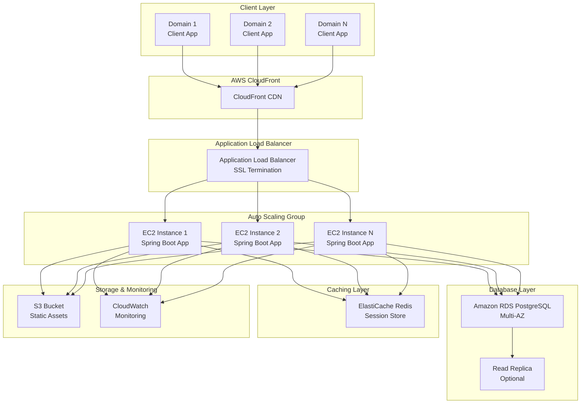

# AWS Deployment Architecture Guide
## Multi-Tenant Spring Boot Application

### Table of Contents
1. [Overview](#overview)
2. [Architecture Design](#architecture-design)
3. [AWS Services Selection](#aws-services-selection)
4. [Database Architecture](#database-architecture)
5. [Application Deployment](#application-deployment)
6. [Load Balancing & Auto Scaling](#load-balancing--auto-scaling)
7. [Cost Optimization](#cost-optimization)
8. [Security Considerations](#security-considerations)
9. [Monitoring & Logging](#monitoring--logging)
10. [Deployment Steps](#deployment-steps)
11. [Configuration Changes](#configuration-changes)
12. [Maintenance & Operations](#maintenance--operations)

---

## Overview

This document outlines the recommended AWS deployment architecture for a multi-tenant Spring Boot application supporting:
- **Initial Scale**: 10 domains, 1000 users/month
- **Growth Potential**: Scalable to 100+ domains, 100K+ users
- **Requirements**: Low cost, low maintenance, fully automated
- **Database**: PostgreSQL with connection pooling
- **Multi-tenancy**: Domain-based tenant isolation

---

## Architecture Design

### High-Level Architecture



---

## AWS Services Selection

### Core Services (Required)

| Service | Purpose | Cost (Monthly) | Justification |
|---------|---------|----------------|---------------|
| **EC2 t3.medium** | Application servers | ~$60 | Balanced CPU/memory for Spring Boot |
| **RDS PostgreSQL db.t3.micro** | Primary database | ~$25 | Multi-AZ for HA, automated backups |
| **Application Load Balancer** | Traffic distribution | ~$25 | SSL termination, health checks |
| **ElastiCache Redis t3.micro** | Session caching | ~$15 | Session clustering, performance |
| **S3 Standard** | Static assets | ~$5 | Unlimited storage, CDN integration |
| **Route 53** | DNS management | ~$5 | Domain routing, health checks |
| **CloudWatch** | Monitoring | ~$10 | Metrics, logs, alerts |

**Total Monthly Cost: ~$145**

### Optional Services (Growth)

| Service | Purpose | When to Add | Cost |
|---------|---------|-------------|------|
| **RDS Read Replica** | Read scaling | 10K+ users | +$25/month |
| **ElastiCache Redis t3.small** | Enhanced caching | 50K+ users | +$30/month |
| **Auto Scaling Group** | Dynamic scaling | Variable load | +$20/month |
| **CloudFront** | Global CDN | Global users | +$10/month |

---

## Database Architecture

### PostgreSQL Configuration

#### Primary Database (RDS)
```yaml
# application-prod-aws.yml
spring:
  datasource:
    type: com.zaxxer.hikari.HikariDataSource
    url: jdbc:postgresql://${DB_HOST}:5432/${DB_NAME}
    username: ${DB_USERNAME}
    password: ${DB_PASSWORD}
    hikari:
      poolName: HikariCP
      maximum-pool-size: 10          # Increased for multi-instance
      minimum-idle: 2
      connection-timeout: 30000
      idle-timeout: 600000
      max-lifetime: 1800000
      leak-detection-threshold: 60000
      validation-timeout: 5000
      connection-test-query: SELECT 1
      # Multi-tenant optimizations
      data-source-properties:
        socketTimeout: 30
        loginTimeout: 10
        connectTimeout: 10
```

#### Connection Pooling Strategy
```java
// Recommended HikariCP settings for multi-tenant
@Configuration
public class DatabaseConfig {
    
    @Value("${spring.datasource.hikari.maximum-pool-size:10}")
    private int maxPoolSize;
    
    @Bean
    @ConfigurationProperties("spring.datasource.hikari")
    public HikariConfig hikariConfig() {
        HikariConfig config = new HikariConfig();
        config.setMaximumPoolSize(maxPoolSize);
        config.setMinimumIdle(2);
        config.setConnectionTimeout(30000);
        config.setIdleTimeout(600000);
        config.setMaxLifetime(1800000);
        config.setLeakDetectionThreshold(60000);
        return config;
    }
}
```

#### Database Scaling Approach
1. **Vertical Scaling**: Start with db.t3.micro → db.t3.small → db.t3.medium
2. **Read Replicas**: Add when read-heavy operations increase
3. **Connection Pooling**: Distributed across multiple application instances
4. **Query Optimization**: Indexes on tenant_id columns

---

## Application Deployment

### EC2 Auto Scaling Configuration

#### Launch Template
```json
{
  "LaunchTemplateName": "spring-boot-app-template",
  "ImageId": "ami-0c02fb55956c7d316", // Amazon Linux 2
  "InstanceType": "t3.medium",
  "KeyName": "your-key-pair",
  "SecurityGroups": ["sg-app-tier"],
  "UserData": "#!/bin/bash\n# Application startup script\n",
  "TagSpecifications": [
    {
      "ResourceType": "instance",
      "Tags": [
        {"Key": "Name", "Value": "SpringBoot-App"},
        {"Key": "Environment", "Value": "Production"}
      ]
    }
  ]
}
```

#### Auto Scaling Group
```yaml
AutoScalingGroup:
  MinSize: 2
  MaxSize: 10
  DesiredCapacity: 2
  TargetGroupARNs: ["arn:aws:elasticloadbalancing:region:account:targetgroup/app-tg"]
  HealthCheckType: ELB
  HealthCheckGracePeriod: 300
  ScalingPolicies:
    - ScaleOutPolicy:
        TargetValue: 70.0  # CPU utilization
        ScaleOutCooldown: 300
        ScaleInCooldown: 600
```

### Application Configuration

#### Environment-Specific Config
```yaml
# application-prod-aws.yml
spring:
  profiles:
    active: prod-aws
  
  datasource:
    url: jdbc:postgresql://${RDS_ENDPOINT}:5432/${DB_NAME}
    username: ${DB_USERNAME}
    password: ${DB_PASSWORD}
    hikari:
      maximum-pool-size: 10
      
  jpa:
    database-platform: org.hibernate.dialect.PostgreSQLDialect
    hibernate:
      ddl-auto: validate
    show-sql: false
    
  redis:
    host: ${REDIS_ENDPOINT}
    port: 6379
    timeout: 2000ms
    lettuce:
      pool:
        max-active: 8
        max-idle: 8
        min-idle: 0

server:
  port: 8080
  servlet:
    context-path: /
    
logging:
  level:
    ROOT: INFO
    com.nextjstemplate: INFO
  pattern:
    console: "%d{yyyy-MM-dd HH:mm:ss} [%thread] %-5level %logger{36} - %msg%n"
```

---

## Load Balancing & Auto Scaling

### Application Load Balancer Setup

#### Target Group Configuration
```yaml
TargetGroup:
  Name: spring-boot-app-tg
  Port: 8080
  Protocol: HTTP
  VpcId: vpc-xxxxxxxx
  HealthCheckPath: /management/health
  HealthCheckIntervalSeconds: 30
  HealthCheckTimeoutSeconds: 5
  HealthyThresholdCount: 2
  UnhealthyThresholdCount: 5
  TargetType: instance
```

#### Load Balancer Rules
```yaml
Rules:
  - Priority: 100
    Conditions:
      - Field: path-pattern
        Values: ["/api/*"]
    Actions:
      - Type: forward
        TargetGroupArn: "arn:aws:elasticloadbalancing:region:account:targetgroup/spring-boot-app-tg"
  - Priority: 200
    Conditions:
      - Field: path-pattern
        Values: ["/static/*"]
    Actions:
      - Type: redirect
        RedirectConfig:
          Protocol: HTTPS
          Port: 443
          StatusCode: HTTP_301
```

### Auto Scaling Policies

#### CPU-Based Scaling
```yaml
ScalingPolicies:
  ScaleOut:
    MetricType: CPUUtilization
    TargetValue: 70.0
    ScaleOutCooldown: 300
    ScaleInCooldown: 600
    
  CustomMetric:
    MetricType: RequestCountPerTarget
    TargetValue: 1000.0
    PredefinedMetricSpecification:
      PredefinedMetricType: ALBRequestCountPerTarget
      ResourceLabel: "app/spring-boot-alb/50dc6c495c0c9188/targetgroup/spring-boot-tg/*"
```

---

## Cost Optimization

### Resource Sizing Strategy

#### Phase 1: Initial Deployment (10 domains, 1K users)
```
- EC2: 2x t3.medium instances (~$60/month)
- RDS: db.t3.micro Multi-AZ (~$25/month)
- Redis: t3.micro (~$15/month)
- ALB: Standard (~$25/month)
- Total: ~$125/month
```

#### Phase 2: Growth (50 domains, 10K users)
```
- EC2: 3-5x t3.medium instances (~$90-150/month)
- RDS: db.t3.small Multi-AZ (~$50/month)
- Redis: t3.small (~$30/month)
- ALB: Standard (~$25/month)
- Total: ~$195-255/month
```

#### Phase 3: Scale (100+ domains, 100K+ users)
```
- EC2: Auto Scaling Group (2-10 instances)
- RDS: db.t3.medium + Read Replica (~$100/month)
- Redis: t3.medium cluster (~$60/month)
- ALB: Standard (~$25/month)
- CloudFront: Global CDN (~$10/month)
- Total: ~$300-500/month (variable)
```

### Cost Optimization Techniques

1. **Reserved Instances**: 1-year term for 30% savings
2. **Spot Instances**: For non-critical workloads (60% savings)
3. **S3 Intelligent Tiering**: Automatic cost optimization
4. **CloudWatch Log Retention**: 30-day retention policy
5. **RDS Automated Backups**: 7-day retention

---

## Security Considerations

### Network Security

#### VPC Configuration
```yaml
VPC:
  CIDR: 10.0.0.0/16
  
Subnets:
  Public:
    - CIDR: 10.0.1.0/24 (AZ-a)
    - CIDR: 10.0.2.0/24 (AZ-b)
    
  Private:
    - CIDR: 10.0.10.0/24 (AZ-a)
    - CIDR: 10.0.20.0/24 (AZ-b)
    
  Database:
    - CIDR: 10.0.100.0/24 (AZ-a)
    - CIDR: 10.0.200.0/24 (AZ-b)
```

#### Security Groups
```yaml
SecurityGroups:
  ALB-SG:
    Inbound:
      - Port: 80, Protocol: TCP, Source: 0.0.0.0/0
      - Port: 443, Protocol: TCP, Source: 0.0.0.0/0
    Outbound:
      - Port: 8080, Protocol: TCP, Destination: App-SG
      
  App-SG:
    Inbound:
      - Port: 8080, Protocol: TCP, Source: ALB-SG
    Outbound:
      - Port: 5432, Protocol: TCP, Destination: DB-SG
      - Port: 6379, Protocol: TCP, Destination: Redis-SG
      
  DB-SG:
    Inbound:
      - Port: 5432, Protocol: TCP, Source: App-SG
    Outbound: []
```

### Application Security

#### SSL/TLS Configuration
```yaml
# SSL Certificate (AWS Certificate Manager)
Certificate:
  Domain: "*.yourdomain.com"
  Validation: DNS
  AutoRenew: true
  
# Application SSL
server:
  ssl:
    enabled: true
    key-store: classpath:keystore.p12
    key-store-password: ${SSL_KEYSTORE_PASSWORD}
    key-store-type: PKCS12
```

#### Multi-Tenant Security
```java
// Tenant isolation at application level
@Component
public class TenantSecurityFilter implements Filter {
    
    @Override
    public void doFilter(ServletRequest request, ServletResponse response, 
                        FilterChain chain) throws IOException, ServletException {
        
        HttpServletRequest httpRequest = (HttpServletRequest) request;
        String tenantId = extractTenantFromDomain(httpRequest);
        
        // Validate tenant exists and is active
        if (!tenantService.isValidTenant(tenantId)) {
            throw new TenantNotFoundException("Invalid tenant: " + tenantId);
        }
        
        // Set tenant context
        TenantContext.setCurrentTenant(tenantId);
        
        try {
            chain.doFilter(request, response);
        } finally {
            TenantContext.clear();
        }
    }
}
```

---

## Monitoring & Logging

### CloudWatch Configuration

#### Application Metrics
```yaml
CloudWatchMetrics:
  CustomMetrics:
    - MetricName: ActiveTenants
      Unit: Count
      Namespace: Application/Tenants
      
    - MetricName: RequestLatency
      Unit: Milliseconds
      Namespace: Application/Performance
      
    - MetricName: DatabaseConnections
      Unit: Count
      Namespace: Application/Database
      
    - MetricName: ErrorRate
      Unit: Percent
      Namespace: Application/Errors
```

#### Log Groups
```yaml
LogGroups:
  - LogGroupName: /aws/ec2/spring-boot-app
    RetentionInDays: 30
    
  - LogGroupName: /aws/rds/postgresql
    RetentionInDays: 7
    
  - LogGroupName: /aws/elasticloadbalancing/application
    RetentionInDays: 14
```

### Application Monitoring

#### Health Checks
```java
@RestController
@RequestMapping("/management")
public class HealthController {
    
    @GetMapping("/health")
    public ResponseEntity<Map<String, Object>> health() {
        Map<String, Object> health = new HashMap<>();
        health.put("status", "UP");
        health.put("timestamp", Instant.now());
        health.put("tenant", TenantContext.getCurrentTenant());
        
        // Database health
        health.put("database", checkDatabaseHealth());
        
        // Redis health
        health.put("redis", checkRedisHealth());
        
        return ResponseEntity.ok(health);
    }
}
```

#### Performance Monitoring
```java
@Component
public class PerformanceMonitor {
    
    private final MeterRegistry meterRegistry;
    
    @EventListener
    public void handleRequest(RequestEvent event) {
        Timer.Sample sample = Timer.start(meterRegistry);
        
        sample.stop(Timer.builder("http.request.duration")
            .tag("tenant", event.getTenantId())
            .tag("endpoint", event.getEndpoint())
            .register(meterRegistry));
    }
}
```

---

## Deployment Steps

### 1. Infrastructure Setup

#### Using AWS CDK (Recommended)
```typescript
// infrastructure/app-stack.ts
export class SpringBootAppStack extends Stack {
  constructor(scope: Construct, id: string, props?: StackProps) {
    super(scope, id, props);

    // VPC
    const vpc = new Vpc(this, 'AppVPC', {
      maxAzs: 2,
      natGateways: 1, // Cost optimization
    });

    // RDS Database
    const database = new DatabaseInstance(this, 'AppDatabase', {
      engine: DatabaseInstanceEngine.postgres({
        version: PostgresEngineVersion.VER_13_7,
      }),
      instanceType: InstanceType.of(InstanceClass.T3, InstanceSize.MICRO),
      vpc,
      multiAz: true,
      backupRetention: Duration.days(7),
    });

    // Redis Cache
    const redis = new CacheCluster(this, 'AppRedis', {
      engine: CacheEngine.REDIS,
      nodeType: CacheNodeType.T3_MICRO_NANO,
      numCacheNodes: 1,
      vpc,
    });

    // Application Load Balancer
    const alb = new ApplicationLoadBalancer(this, 'AppALB', {
      vpc,
      internetFacing: true,
    });

    // Auto Scaling Group
    const asg = new AutoScalingGroup(this, 'AppASG', {
      vpc,
      instanceType: InstanceType.of(InstanceClass.T3, InstanceSize.MEDIUM),
      machineImage: MachineImage.latestAmazonLinux2(),
      minCapacity: 2,
      maxCapacity: 10,
      desiredCapacity: 2,
    });

    // Target Group
    const targetGroup = new ApplicationTargetGroup(this, 'AppTargetGroup', {
      port: 8080,
      vpc,
      healthCheck: {
        path: '/management/health',
        healthyHttpCodes: '200',
      },
    });

    asg.attachToApplicationTargetGroup(targetGroup);
    alb.addListener('AppListener', {
      port: 80,
      defaultTargetGroups: [targetGroup],
    });
  }
}
```

### 2. Application Deployment

#### Build & Package
```bash
# Build the application
./mvnw clean package -Pprod-aws -DskipTests

# Create Docker image
docker build -t spring-boot-app:latest .

# Push to ECR
aws ecr get-login-password --region us-east-1 | docker login --username AWS --password-stdin 123456789012.dkr.ecr.us-east-1.amazonaws.com
docker tag spring-boot-app:latest 123456789012.dkr.ecr.us-east-1.amazonaws.com/spring-boot-app:latest
docker push 123456789012.dkr.ecr.us-east-1.amazonaws.com/spring-boot-app:latest
```

#### Deployment Script
```bash
#!/bin/bash
# deploy.sh

# Update Auto Scaling Group
aws autoscaling update-auto-scaling-group \
  --auto-scaling-group-name spring-boot-asg \
  --launch-template LaunchTemplateName=spring-boot-template,Version=\$Latest

# Rolling deployment
aws autoscaling start-instance-refresh \
  --auto-scaling-group-name spring-boot-asg \
  --preferences MinHealthyPercentage=50,InstanceWarmup=300

echo "Deployment initiated. Monitor progress in AWS Console."
```

### 3. Database Migration

#### Liquibase Migration
```bash
# Run database migrations
java -jar target/spring-boot-app.jar \
  --spring.profiles.active=prod-aws \
  --spring.liquibase.enabled=true \
  --spring.jpa.hibernate.ddl-auto=validate
```

---

## Configuration Changes

### Minimal Code Changes Required

#### 1. Add AWS Profile
```yaml
# src/main/resources/config/application-prod-aws.yml
spring:
  profiles:
    active: prod-aws
    
  datasource:
    url: jdbc:postgresql://${RDS_ENDPOINT}:5432/${DB_NAME}
    username: ${DB_USERNAME}
    password: ${DB_PASSWORD}
    
  redis:
    host: ${REDIS_ENDPOINT}
    port: 6379
    
server:
  port: 8080
  
logging:
  level:
    ROOT: INFO
    com.nextjstemplate: INFO
```

#### 2. Environment Variables
```bash
# Set in EC2 User Data or Parameter Store
export RDS_ENDPOINT=your-rds-endpoint.region.rds.amazonaws.com
export DB_NAME=your_database_name
export DB_USERNAME=your_db_username
export DB_PASSWORD=your_db_password
export REDIS_ENDPOINT=your-redis-endpoint.cache.amazonaws.com
export SPRING_PROFILES_ACTIVE=prod-aws
```

#### 3. Dockerfile (Optional)
```dockerfile
FROM openjdk:11-jre-slim

WORKDIR /app
COPY target/spring-boot-app.jar app.jar

EXPOSE 8080

ENTRYPOINT ["java", "-jar", "app.jar"]
```

---

## Maintenance & Operations

### Automated Operations

#### 1. Database Maintenance
```bash
# Automated backup verification
aws rds describe-db-snapshots \
  --db-instance-identifier your-db-instance \
  --snapshot-type automated \
  --query 'DBSnapshots[0].SnapshotCreateTime'
```

#### 2. Application Updates
```bash
# Blue-green deployment script
#!/bin/bash
# blue-green-deploy.sh

OLD_ASG="spring-boot-asg-blue"
NEW_ASG="spring-boot-asg-green"

# Deploy to green environment
# ... deployment steps ...

# Switch traffic
aws elbv2 modify-target-group-attributes \
  --target-group-arn $TARGET_GROUP_ARN \
  --attributes Key=deregistration_delay.timeout_seconds,Value=0

# Terminate old instances
aws autoscaling delete-auto-scaling-group \
  --auto-scaling-group-name $OLD_ASG \
  --force-delete
```

#### 3. Monitoring & Alerts
```yaml
CloudWatchAlarms:
  - AlarmName: HighCPUUtilization
    MetricName: CPUUtilization
    Threshold: 80
    ComparisonOperator: GreaterThanThreshold
    EvaluationPeriods: 2
    
  - AlarmName: DatabaseConnectionsHigh
    MetricName: DatabaseConnections
    Threshold: 80
    ComparisonOperator: GreaterThanThreshold
    EvaluationPeriods: 1
    
  - AlarmName: ApplicationErrors
    MetricName: ErrorRate
    Threshold: 5
    ComparisonOperator: GreaterThanThreshold
    EvaluationPeriods: 1
```

### Cost Monitoring

#### Budget Alerts
```yaml
Budgets:
  - BudgetName: MonthlyAWSBudget
    BudgetLimit: 200  # USD
    TimeUnit: MONTHLY
    BudgetType: COST
    Notifications:
      - Threshold: 80
        NotificationType: ACTUAL
        ComparisonOperator: GREATER_THAN
        Subscribers:
          - SubscriptionType: EMAIL
            Address: admin@yourdomain.com
```

---

## Scaling Strategy

### Horizontal Scaling Triggers

| Metric | Threshold | Action | New Capacity |
|--------|-----------|---------|--------------|
| CPU Utilization | > 70% | Scale Out | +1 instance |
| Memory Utilization | > 80% | Scale Out | +1 instance |
| Request Latency | > 500ms | Scale Out | +1 instance |
| Error Rate | > 5% | Scale Out | +1 instance |
| Database Connections | > 80% | Add Read Replica | +1 replica |

### Vertical Scaling Plan

#### Phase 1: Initial (0-1K users)
- EC2: t3.medium (2 vCPU, 4 GB RAM)
- RDS: db.t3.micro (1 vCPU, 1 GB RAM)
- Redis: t3.micro (1 vCPU, 0.5 GB RAM)

#### Phase 2: Growth (1K-10K users)
- EC2: t3.large (2 vCPU, 8 GB RAM)
- RDS: db.t3.small (1 vCPU, 2 GB RAM)
- Redis: t3.small (1 vCPU, 1.37 GB RAM)

#### Phase 3: Scale (10K+ users)
- EC2: t3.xlarge (4 vCPU, 16 GB RAM)
- RDS: db.t3.medium (2 vCPU, 4 GB RAM)
- Redis: t3.medium (2 vCPU, 3.09 GB RAM)

---

## Disaster Recovery

### Backup Strategy
```yaml
Backups:
  Database:
    - Type: Automated
    - Retention: 7 days
    - CrossRegion: Yes
    
  Application:
    - Type: AMI Snapshots
    - Frequency: Weekly
    - Retention: 4 weeks
    
  Configuration:
    - Type: Parameter Store
    - Encryption: Yes
    - Backup: Git repository
```

### Recovery Procedures
```bash
# Database Recovery
aws rds restore-db-instance-from-db-snapshot \
  --db-instance-identifier restored-db \
  --db-snapshot-identifier your-snapshot-id

# Application Recovery
aws autoscaling create-auto-scaling-group \
  --auto-scaling-group-name recovery-asg \
  --launch-template LaunchTemplateName=spring-boot-template \
  --min-size 1 \
  --max-size 3 \
  --desired-capacity 1
```

---

## Conclusion

This architecture provides:

✅ **Cost-Effective**: Starting at ~$125/month, scaling to ~$300-500/month
✅ **Highly Available**: Multi-AZ deployment with auto-scaling
✅ **Low Maintenance**: Fully automated deployments and scaling
✅ **Secure**: VPC isolation, SSL/TLS, tenant isolation
✅ **Scalable**: Horizontal and vertical scaling capabilities
✅ **Minimal Code Changes**: Configuration-driven approach

The solution balances cost optimization with performance requirements while maintaining the flexibility to scale as your multi-tenant application grows.

---

*Last Updated: January 2025*
*Version: 1.0*
