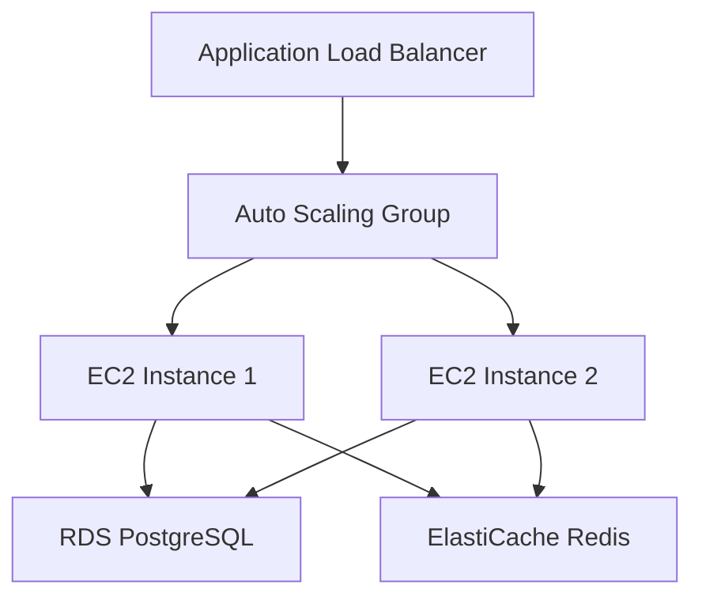
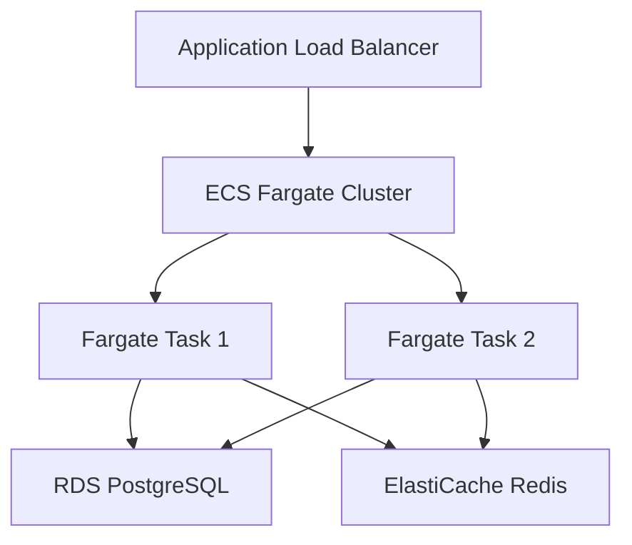
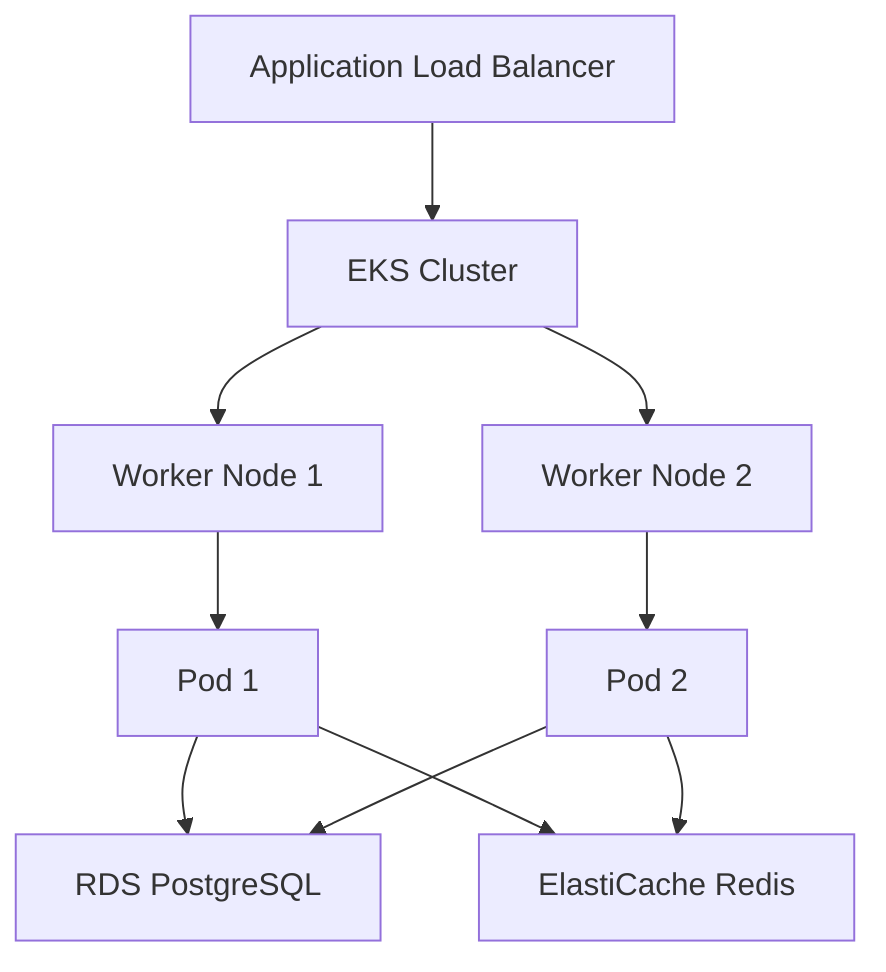

# AWS Deployment Architecture Guide - Updated (Fargate/EKS)
## Multi-Tenant Spring Boot Application

### Table of Contents
1. [Overview](#overview)
2. [Architecture Comparison](#architecture-comparison)
3. [Recommended Architecture: Fargate](#recommended-architecture-fargate)
4. [Alternative: EKS](#alternative-eks)
5. [Local Development & Testing](#local-development--testing)
6. [Cost Comparison](#cost-comparison)
7. [Migration Strategy](#migration-strategy)

---

## Overview

Based on your feedback, here are the **three deployment options** with automation levels:

| Option | Automation Level | Cost | Maintenance | Best For |
|--------|------------------|------|-------------|----------|
| **EC2 + Auto Scaling** | Medium | Medium | Medium | Traditional workloads |
| **Fargate** | High | Low-Medium | Low | Serverless containers |
| **EKS** | Very High | Medium-High | Very Low | Microservices, advanced orchestration |

---

## Architecture Comparison

### Option 1: EC2 + Auto Scaling (Original)


**Pros**: Full control, predictable costs
**Cons**: More management overhead, manual scaling

### Option 2: Fargate (Recommended)


**Pros**: No server management, auto-scaling, pay-per-use
**Cons**: Less control over underlying infrastructure

### Option 3: EKS (Advanced)


**Pros**: Kubernetes ecosystem, advanced orchestration
**Cons**: Higher complexity, steeper learning curve

---

## Recommended Architecture: Fargate

### Why Fargate is Better for Your Use Case

✅ **Fully Automated**: No server management required
✅ **Cost Effective**: Pay only for running containers
✅ **Auto Scaling**: Built-in container scaling
✅ **Zero Maintenance**: AWS handles infrastructure
✅ **Fast Deployment**: Containers start in seconds
✅ **Security**: Isolated containers, no shared infrastructure

### Updated Cost Analysis (Fargate)

#### Phase 1: Initial (10 domains, 1K users)
```
- ECS Fargate: 2 tasks × 0.5 vCPU × 1GB RAM = ~$30/month
- RDS PostgreSQL: db.t3.micro Multi-AZ = ~$25/month
- ElastiCache Redis: t3.micro = ~$15/month
- Application Load Balancer = ~$25/month
- Total: ~$95/month (vs $125 for EC2)
```

#### Phase 2: Growth (50 domains, 10K users)
```
- ECS Fargate: 3-5 tasks × 1 vCPU × 2GB RAM = ~$60-100/month
- RDS PostgreSQL: db.t3.small Multi-AZ = ~$50/month
- ElastiCache Redis: t3.small = ~$30/month
- Application Load Balancer = ~$25/month
- Total: ~$165-205/month (vs $200 for EC2)
```

#### Phase 3: Scale (100+ domains, 100K+ users)
```
- ECS Fargate: 5-10 tasks × 2 vCPU × 4GB RAM = ~$200-400/month
- RDS PostgreSQL: db.t3.medium + Read Replica = ~$100/month
- ElastiCache Redis: t3.medium cluster = ~$60/month
- Application Load Balancer = ~$25/month
- Total: ~$385-585/month (vs $300-500 for EC2)
```

### Fargate Configuration

```yaml
# Fargate Task Definition
TaskDefinition:
  Family: malayalees-app
  NetworkMode: awsvpc
  RequiresCompatibilities: FARGATE
  Cpu: 512          # 0.5 vCPU
  Memory: 1024      # 1 GB RAM
  ExecutionRoleArn: arn:aws:iam::account:role/ecsTaskExecutionRole
  TaskRoleArn: arn:aws:iam::account:role/ecsTaskRole
  ContainerDefinitions:
    - Name: app
      Image: 123456789012.dkr.ecr.us-east-1.amazonaws.com/malayalees-app:latest
      PortMappings:
        - ContainerPort: 8080
          Protocol: tcp
      Environment:
        - Name: SPRING_PROFILES_ACTIVE
          Value: prod-aws
        - Name: RDS_ENDPOINT
          Value: your-rds-endpoint.rds.amazonaws.com
        - Name: REDIS_ENDPOINT
          Value: your-redis-endpoint.cache.amazonaws.com
      Secrets:
        - Name: DB_PASSWORD
          ValueFrom: arn:aws:secretsmanager:region:account:secret:db-password
      LogConfiguration:
        LogDriver: awslogs
        Options:
          awslogs-group: /ecs/malayalees-app
          awslogs-region: us-east-1
          awslogs-stream-prefix: ecs
```

---

## Alternative: EKS

### When to Choose EKS

✅ **Microservices Architecture**: Multiple services
✅ **Advanced Orchestration**: Complex deployments
✅ **Kubernetes Ecosystem**: Helm, Istio, etc.
✅ **Team Expertise**: Kubernetes knowledge available
✅ **Multi-Cloud**: Portability across clouds

### EKS Configuration

```yaml
# Kubernetes Deployment
apiVersion: apps/v1
kind: Deployment
metadata:
  name: malayalees-app
spec:
  replicas: 3
  selector:
    matchLabels:
      app: malayalees-app
  template:
    metadata:
      labels:
        app: malayalees-app
    spec:
      containers:
      - name: app
        image: 123456789012.dkr.ecr.us-east-1.amazonaws.com/malayalees-app:latest
        ports:
        - containerPort: 8080
        env:
        - name: SPRING_PROFILES_ACTIVE
          value: "prod-aws"
        resources:
          requests:
            memory: "512Mi"
            cpu: "250m"
          limits:
            memory: "1Gi"
            cpu: "500m"
        livenessProbe:
          httpGet:
            path: /management/health
            port: 8080
          initialDelaySeconds: 60
          periodSeconds: 30
        readinessProbe:
          httpGet:
            path: /management/health
            port: 8080
          initialDelaySeconds: 30
          periodSeconds: 10
```

---

## Local Development & Testing

### Complete Local Testing Environment

#### 1. Docker Compose for Local Testing

```yaml
# docker-compose.local.yml
version: '3.8'

services:
  # PostgreSQL Database
  postgres:
    image: postgres:13
    environment:
      POSTGRES_DB: malayalees_us_site
      POSTGRES_USER: postgres
      POSTGRES_PASSWORD: password
    ports:
      - "5432:5432"
    volumes:
      - postgres_data:/var/lib/postgresql/data
      - ./init-scripts:/docker-entrypoint-initdb.d
    healthcheck:
      test: ["CMD-SHELL", "pg_isready -U postgres"]
      interval: 10s
      timeout: 5s
      retries: 5

  # Redis Cache
  redis:
    image: redis:6-alpine
    ports:
      - "6379:6379"
    volumes:
      - redis_data:/data
    healthcheck:
      test: ["CMD", "redis-cli", "ping"]
      interval: 10s
      timeout: 5s
      retries: 5

  # Spring Boot Application
  app:
    build:
      context: .
      dockerfile: Dockerfile.local
    ports:
      - "8080:8080"
    environment:
      SPRING_PROFILES_ACTIVE: local
      RDS_ENDPOINT: postgres
      DB_NAME: malayalees_us_site
      DB_USERNAME: postgres
      DB_PASSWORD: password
      REDIS_ENDPOINT: redis
      REDIS_PORT: 6379
    depends_on:
      postgres:
        condition: service_healthy
      redis:
        condition: service_healthy
    volumes:
      - ./logs:/var/log/spring-boot-app

  # pgAdmin (Optional - Database Management)
  pgadmin:
    image: dpage/pgadmin4
    environment:
      PGADMIN_DEFAULT_EMAIL: admin@local.com
      PGADMIN_DEFAULT_PASSWORD: admin
    ports:
      - "5050:80"
    depends_on:
      - postgres

  # Redis Commander (Optional - Redis Management)
  redis-commander:
    image: rediscommander/redis-commander
    environment:
      REDIS_HOSTS: local:redis:6379
    ports:
      - "8081:8081"
    depends_on:
      - redis

volumes:
  postgres_data:
  redis_data:
```

#### 2. Local Dockerfile

```dockerfile
# Dockerfile.local
FROM openjdk:11-jre-slim

WORKDIR /app

# Copy the JAR file
COPY target/*.jar app.jar

# Create logs directory
RUN mkdir -p /var/log/spring-boot-app

EXPOSE 8080

# Health check
HEALTHCHECK --interval=30s --timeout=10s --start-period=60s --retries=3 \
    CMD curl -f http://localhost:8080/management/health || exit 1

ENTRYPOINT ["java", "-jar", "app.jar"]
```

#### 3. Local Configuration

```yaml
# src/main/resources/config/application-local.yml
spring:
  profiles:
    active: local
  
  datasource:
    url: jdbc:postgresql://${RDS_ENDPOINT:localhost}:5432/${DB_NAME:malayalees_us_site}
    username: ${DB_USERNAME:postgres}
    password: ${DB_PASSWORD:password}
    hikari:
      maximum-pool-size: 5
      minimum-idle: 1
  
  data:
    redis:
      host: ${REDIS_ENDPOINT:localhost}
      port: ${REDIS_PORT:6379}
      timeout: 2000ms
  
  liquibase:
    enabled: true
    contexts: local
  
  jpa:
    hibernate:
      ddl-auto: update
    show-sql: true

server:
  port: 8080

logging:
  level:
    ROOT: INFO
    com.nextjstemplate: DEBUG
    org.hibernate.SQL: DEBUG
  pattern:
    console: "%d{yyyy-MM-dd HH:mm:ss} [%thread] %-5level %logger{36} - %msg%n"

management:
  endpoints:
    web:
      exposure:
        include: health,info,metrics
```

#### 4. Local Testing Scripts

```bash
# scripts/local-test.sh
#!/bin/bash

echo "🚀 Starting Local Testing Environment"

# Build application
echo "📦 Building application..."
./mvnw clean package -DskipTests

# Start services
echo "🐳 Starting Docker services..."
docker-compose -f docker-compose.local.yml up -d

# Wait for services to be ready
echo "⏳ Waiting for services to be ready..."
sleep 30

# Run database migrations
echo "🗄️ Running database migrations..."
docker-compose -f docker-compose.local.yml exec app java -jar app.jar --spring.profiles.active=local --spring.liquibase.enabled=true

# Run tests
echo "🧪 Running tests..."
./mvnw test -Ptest-local

# Health check
echo "🏥 Performing health check..."
curl -f http://localhost:8080/management/health || exit 1

echo "✅ Local environment is ready!"
echo "📊 Application: http://localhost:8080"
echo "🗄️ pgAdmin: http://localhost:5050 (admin@local.com/admin)"
echo "📦 Redis Commander: http://localhost:8081"
```

#### 5. Test Data Setup

```sql
-- src/main/resources/init-scripts/01-test-data.sql
-- Insert test tenants
INSERT INTO tenant_organization (id, tenant_id, organization_name, domain_name, is_active, created_at, updated_at)
VALUES 
    (1, 'tenant_demo_001', 'Demo Organization 1', 'demo1.local', true, NOW(), NOW()),
    (2, 'tenant_demo_002', 'Demo Organization 2', 'demo2.local', true, NOW(), NOW()),
    (3, 'tenant_demo_003', 'Demo Organization 3', 'demo3.local', true, NOW(), NOW());

-- Insert test users
INSERT INTO user_profile (id, tenant_id, email, first_name, last_name, is_active, created_at, updated_at)
VALUES 
    (1, 'tenant_demo_001', 'user1@demo1.local', 'John', 'Doe', true, NOW(), NOW()),
    (2, 'tenant_demo_002', 'user2@demo2.local', 'Jane', 'Smith', true, NOW(), NOW()),
    (3, 'tenant_demo_003', 'user3@demo3.local', 'Bob', 'Johnson', true, NOW(), NOW());

-- Insert test events
INSERT INTO event_details (id, tenant_id, title, description, event_date, created_by_id, created_at, updated_at)
VALUES 
    (1, 'tenant_demo_001', 'Test Event 1', 'Test event for demo 1', NOW() + INTERVAL '7 days', 1, NOW(), NOW()),
    (2, 'tenant_demo_002', 'Test Event 2', 'Test event for demo 2', NOW() + INTERVAL '14 days', 2, NOW(), NOW());
```

---

## Cost Comparison Summary

| Service | EC2 | Fargate | EKS |
|---------|-----|---------|-----|
| **Initial (1K users)** | $125/month | $95/month | $120/month |
| **Growth (10K users)** | $200/month | $165/month | $200/month |
| **Scale (100K users)** | $300-500/month | $385-585/month | $400-600/month |
| **Management Overhead** | High | Low | Very Low |
| **Auto-scaling** | Manual setup | Built-in | Advanced |
| **Learning Curve** | Low | Low | High |

---

## Migration Strategy

### Phase 1: Local Testing (Week 1)
1. Set up Docker Compose environment
2. Test all functionality locally
3. Validate database migrations
4. Test multi-tenant features

### Phase 2: Fargate Deployment (Week 2)
1. Deploy to Fargate (recommended)
2. Test auto-scaling
3. Validate monitoring
4. Performance testing

### Phase 3: Production Optimization (Week 3)
1. Fine-tune auto-scaling policies
2. Optimize database connections
3. Set up monitoring alerts
4. Load testing

---

## Recommendation

**Go with Fargate** because:

✅ **Lower Total Cost of Ownership**: No server management
✅ **Faster Time to Market**: Deploy in hours, not days
✅ **Better Resource Utilization**: Pay only for what you use
✅ **Automatic Scaling**: Handles traffic spikes seamlessly
✅ **Security**: Isolated containers, no shared infrastructure
✅ **Future-Proof**: Easy migration to EKS later if needed

The local testing environment I've provided will let you test everything before deploying to AWS, ensuring a smooth transition.

---

*Last Updated: January 2025*
*Version: 2.0*
